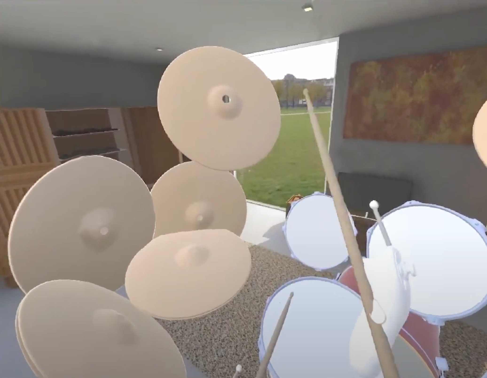
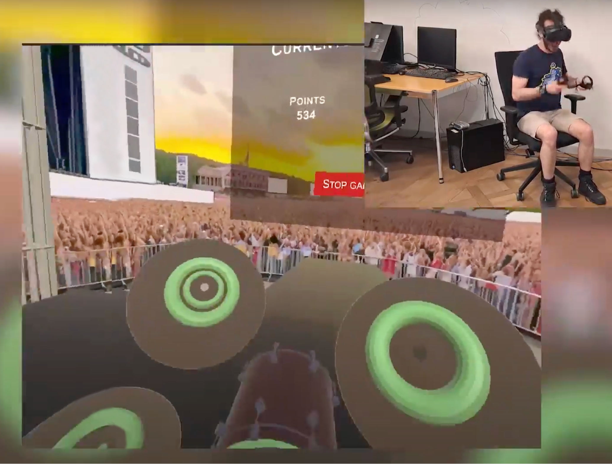

# VRhythm

**VRhythm** is a VR drumming simulator that delivers an immersive 360-degree drumming experience. It offers two modes: Playground Mode and Performance Mode. In Playground Mode, you can practice your drumming skills. Then, in Performance Mode, you can demonstrate your talent on a virtual stage in front of thousands of spectators, with a scoring system to monitor your performance.

### Playground Mode

### Performance Mode

